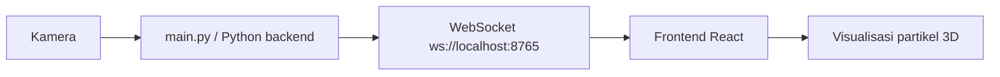

# Particle Visualizer

`ParticleVisualizer` adalah project visualisasi partikel interaktif yang merespons deteksi tangan dan bahasa isyarat. Aplikasi ini menggabungkan pemrosesan citra di Python dengan pengalaman visual 3D di browser agar hasilnya terasa hidup, ekspresif, dan mudah dieksplorasi.

## Gambaran singkat

| Komponen | Teknologi | Peran |
| --- | --- | --- |
| Backend | Python 3.12.4 | Deteksi tangan, klasifikasi gesture, dan WebSocket broadcaster |
| Frontend | React + Vite + Three.js | Visualisasi partikel dan scene 3D |
| Dokumentasi | Markdown di `docs/` | Panduan instalasi, penggunaan, dan referensi alfabet |

## Fitur utama

- Deteksi tangan berbasis kamera
- Pemetaan gesture ke teks / bentuk visual
- Sinkronisasi data ke frontend melalui WebSocket lokal
- Visualisasi partikel 3D berbasis React Three Fiber
- Dokumentasi terpisah untuk backend, frontend, dan referensi alfabet bahasa isyarat

## Mulai cepat

1. Aktifkan environment Python (`.venv`)
2. Install dependency dari `requirements.txt`
3. Jalankan backend Python melalui `main.py`
4. Masuk ke folder `web/`
5. Install dependency npm
6. Jalankan frontend React dengan Vite

Panduan lengkap tersedia di:

- [Backend Python](docs/flask.md)
- [Backend Python detail](docs/python-backend.md)
- [Frontend React](docs/react-frontend.md)
- [Alphabet Bahasa Isyarat](docs/sign-language-alphabet.md)

## Referensi visual

Gambar di atas digunakan sebagai referensi alfabet bahasa isyarat untuk memahami bentuk tangan huruf A–Z. Penjelasan lengkap tiap huruf tersedia di [dokumentasi alfabet bahasa isyarat](docs/sign-language-alphabet.md).

## Arsitektur singkat

## Struktur proyek

- `main.py` — entry point backend Python
- `hand_tacking/` — helper deteksi tangan dan stabilisasi gesture
- `particles/` — engine partikel
- `recognition/` — translasi gesture ke teks
- `web/` — frontend React
- `docs/` — dokumentasi publik proyek

## Status backend

Backend yang aktif saat ini **belum menggunakan Flask**. Implementasi berjalan melalui script Python utama dan WebSocket lokal. Dokumentasi backend dipisah agar mudah diikuti, dan tetap siap jika nantinya backend dipindahkan ke Flask atau framework lain.

## Kontribusi visual baru

Kami sangat terbuka untuk kontribusi visual baru dari komunitas.

Bila kamu ingin berkontribusi, silakan buat bentuk visual baru yang segar dan menarik untuk project ini. Kamu boleh menggunakan AI, boleh juga mengandalkan kreasi sendiri. Yang paling penting adalah hasilnya tetap selaras dengan karakter project: interaktif, artistik, dan menyenangkan untuk dijelajahi.

Ide kontribusi yang sangat kami sambut:

- bentuk particle baru untuk huruf atau gesture tertentu
- gaya visual alternatif yang lebih elegan, futuristik, atau organik
- efek transisi yang lebih halus dan sinematik
- eksperimen berbasis AI yang tetap menjaga identitas visual project

Selama kontribusi kamu sejalan dengan arah project, semua ide kreatif sangat dihargai.

