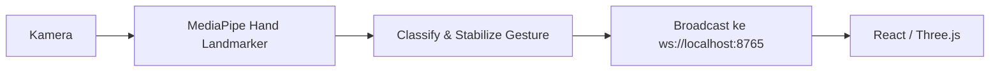

# Backend Python detail

Dokumen ini menjelaskan alur teknis backend `ParticleVisualizer` secara lebih rinci.

> Catatan penting: backend saat ini **belum menggunakan Flask**. Implementasi aktif berjalan melalui `main.py` dan menyiarkan data hand tracking ke WebSocket lokal untuk dikonsumsi frontend React.

## Versi runtime

- **Python 3.12.4**

## Prasyarat

Pastikan kamu sudah menyiapkan:

- Python 3.12.x
- kamera yang berfungsi
- repository sudah berada di komputer lokal

## Setup `.venv`

### Windows PowerShell

Jalankan dari root project:

```powershell
py -3.12 -m venv .venv
.\.venv\Scripts\Activate.ps1
python --version
```

Jika `.venv` sudah ada, cukup aktifkan lingkungan tersebut.

### Verifikasi interpreter aktif

Setelah aktivasi, pastikan Python yang digunakan berasal dari `.venv`:

```powershell
python --version
where python
```

## Install dependency

```powershell
pip install -r requirements.txt
```

## Menjalankan backend

```powershell
python main.py
```

## Alur kerja backend



## Peran utama backend

Backend bertanggung jawab untuk:

- membaca input kamera secara real-time
- mendeteksi landmark tangan
- mengenali dan menstabilkan gesture
- mengirim data ke frontend melalui WebSocket lokal
- menjadi sumber data untuk visualisasi partikel

## Troubleshooting

- Jika kamera gagal dibuka, pastikan tidak sedang dipakai aplikasi lain.
- Jika frontend tidak menerima data, pastikan backend sudah berjalan dan port `8765` belum dipakai proses lain.
- Jika instalasi package gagal, pastikan `.venv` sudah aktif sebelum menjalankan `pip install`.

## Catatan pengembangan

Jika backend nanti dipindahkan ke Flask, dokumen ini tetap bisa dipakai sebagai referensi arsitektur dan alur data. Yang berubah hanya lapisan server, bukan tujuan utamanya: menyediakan data hand tracking untuk frontend.
