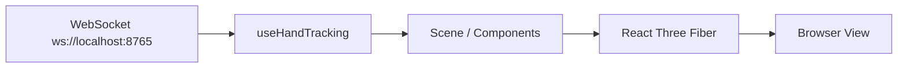

# Frontend React

Panduan ini menjelaskan cara menyiapkan dan menjalankan antarmuka web `ParticleVisualizer`.

## Gambaran umum

Frontend berada di folder `web/` dan dibangun dengan:

- React
- Vite
- Three.js / React Three Fiber

Frontend menerima data gesture dan landmark dari WebSocket lokal yang disediakan oleh backend Python.

## Prasyarat

Pastikan kamu sudah menyiapkan:

- Node.js versi LTS
- npm
- backend Python sudah berjalan di `ws://localhost:8765`

## Install dependency

Masuk ke folder frontend lalu install dependency:

```powershell
cd web
npm install
```

## Menjalankan frontend

Jalankan Vite dev server:

```powershell
cd web
npm run dev
```

Setelah server aktif, buka URL yang ditampilkan terminal. Secara default biasanya:

- `http://localhost:5173`

## Build untuk production

Jika ingin membuat build produksi:

```powershell
cd web
npm run build
```

## Alur kerja frontend



## Urutan menjalankan project

1. Aktifkan `.venv`
2. Install `requirements.txt`
3. Jalankan `python main.py`
4. Masuk ke folder `web/`
5. Jalankan `npm install`
6. Jalankan `npm run dev`
7. Buka aplikasi di browser

## Troubleshooting

- Jika halaman kosong, pastikan backend Python sudah aktif.
- Jika koneksi WebSocket gagal, cek apakah port `8765` terbuka.
- Jika build gagal, hapus `node_modules` lalu install ulang dengan `npm install`.

## Catatan pengembangan

Folder `web/` adalah tempat yang tepat untuk menambahkan visual baru, efek partikel baru, atau eksperimen grafis lain yang mengikuti data gesture dari backend.
